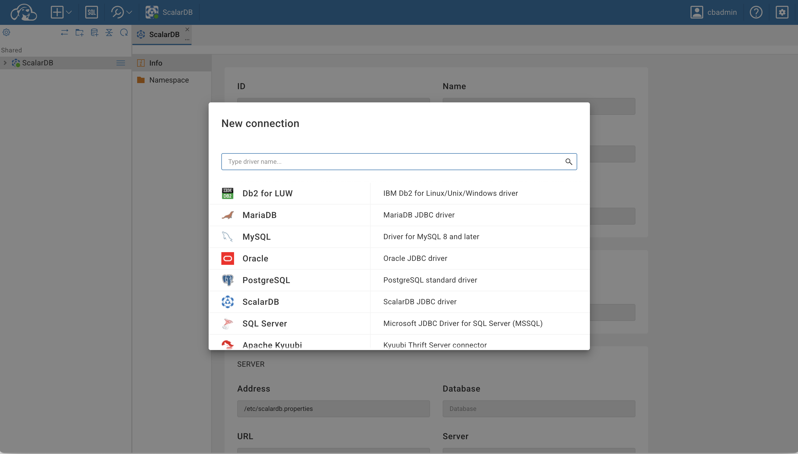
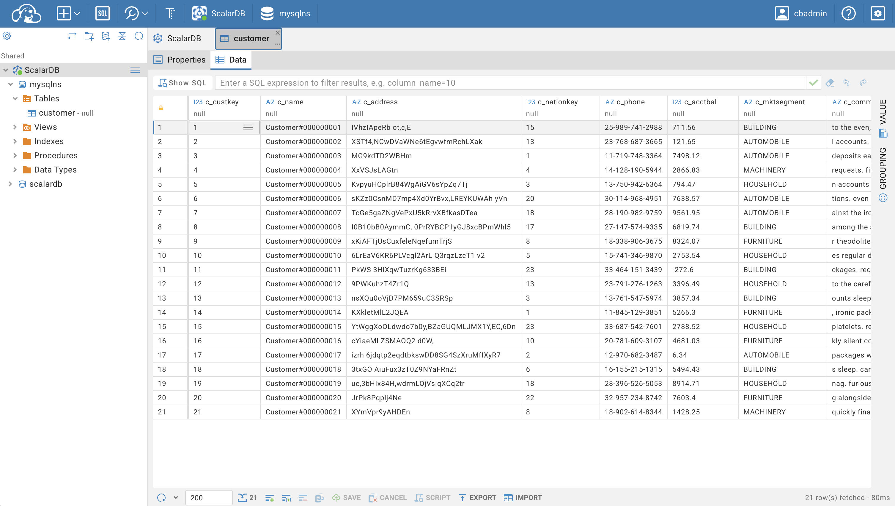
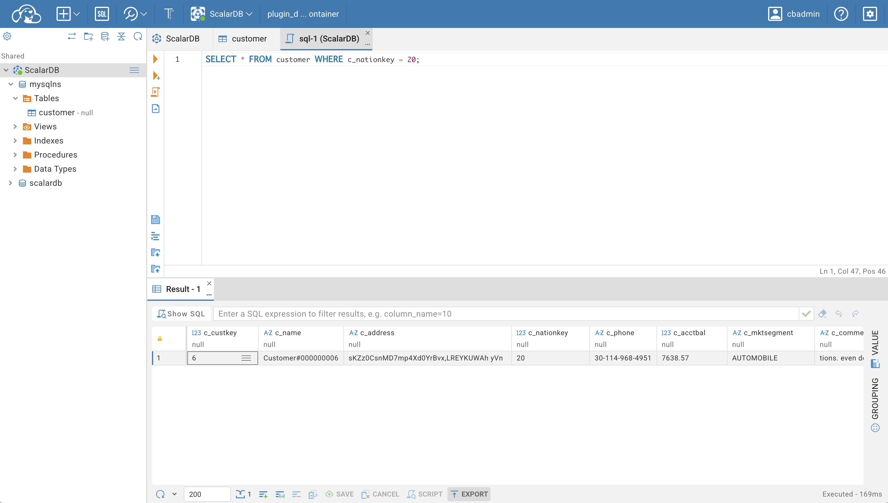
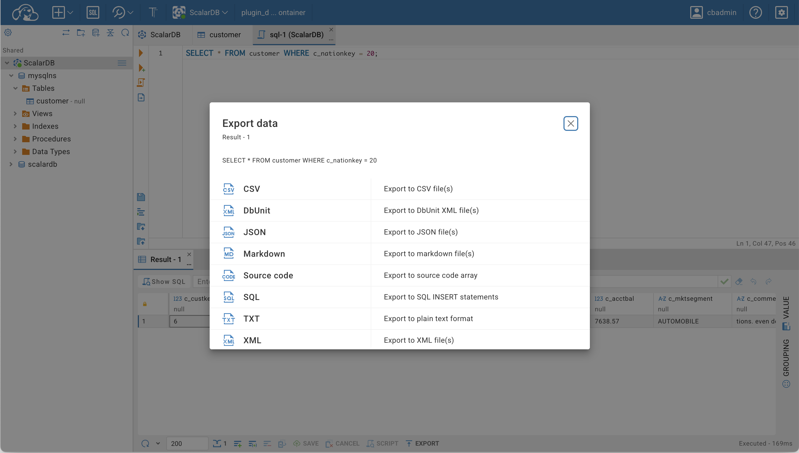

# CloudBeaver Community Edition with Support for ScalarDB

CloudBeaver is a light modern web-application for the database management. Out-of-the-box CloudBeaver supports various SQL, NoSQL and BigData data sources. This repository provides a forked version that supports ScalarDB and free to use and open-source (licensed under [Apache 2](https://github.com/dbeaver/cloudbeaver/blob/devel/LICENSE) license). See the original [repository](https://github.com/dbeaver/cloudbeaver/) and [WIKI](https://github.com/dbeaver/cloudbeaver/wiki) for more details about CloudBeaver.

<a></a>




## Run in Docker

1. Prepare a client configuration file to connect ScalarDB Cluster. For details about the configuration, see [Client Configurations](https://scalardb.scalar-labs.com/docs/latest/scalardb-cluster/scalardb-cluster-configurations/#client-configurations).

1. Prepare a docker compose file and map the above configuration file to `/etc/scalardb.properties`. 

   ```yaml
   services:
     cloudbeaver:
       image: ghcr.io/scalar-labs/cloudbeaver:latest
       ports:
         - 8978:8978
       volumes:
         - ./workspace:/opt/cloudbeaver/workspace
         - ./scalardb.properties:/etc/scalardb.properties
   ```

1. Run the docker container

   ```console
   docker compose up -d
   ```

## How to access ScalarDB through CloudBeaver

- Once CloudBeaver is running, access http://localhost:8978/ and complete the setup based on [Administration](https://github.com/dbeaver/cloudbeaver/wiki/Administration).
- When creating a new connection setting, you will see ScalarDB in the database list and select it.
- Keep the file path in the Host field as is in the connection setting, and only change the Connection name as desired.
- If prompted for credentials when establishing the connection, no input is required unless Authentication is enabled (even when Authentication is enabled, no input is required if username/password are specified in the configuration file).

## Known Limitations

- In SQL, [BEGIN](https://scalardb.scalar-labs.com/docs/latest/scalardb-sql/grammar#begin) is not supported, so use [START TRANSACTION](https://scalardb.scalar-labs.com/docs/latest/scalardb-sql/grammar#start-transaction) instead.
- When editing data using [Data editor](https://github.com/dbeaver/cloudbeaver/wiki/Data-editor), integers can only be edited if they are of `BigInt` type.
